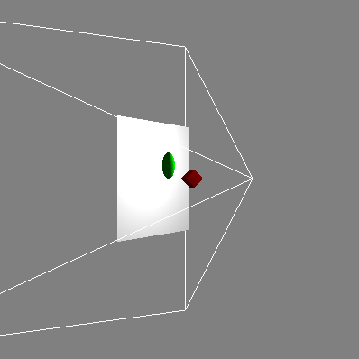
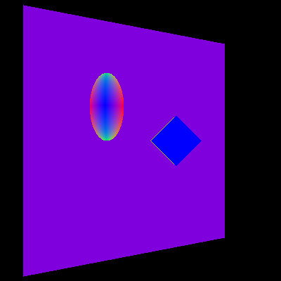
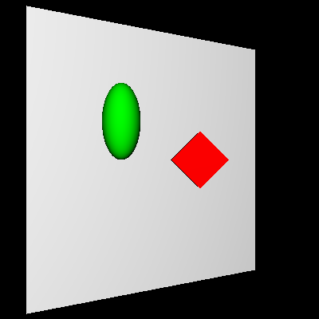
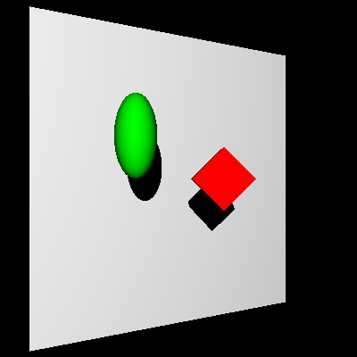

Ray Tracer Part I
======================

**University of Pennsylvania, CIS 561: Advanced Computer Graphics, Homework 1**

Overview
------------
You will implement a collection of functions in order to create the foundation
of a ray tracer. You will begin by coding various ray-object intersection tests,
then move on to writing a basic surface light reflection function. Finally, you
will implement a method for determining where objects should cast shadows on
other objects.

We have provided you with a camera that you can control to view your scene along
with an OpenGL preview window that will show you basic information about the
scene, such as object positions and colors. Note that the controllable camera
is not the same as the one that will be used to ray trace your scene. Use the
`Help` drop down menu to view controls for the camera.

Ray Class (5 points)
--------
We have provided you with a mostly-complete `Ray` class in `ray.h`. It declares
but does not define the function `GetTransformedCopy`. Implement this function
so that it takes in a transformation matrix and returns a
__copy__ of the Ray that has been transformed by said matrix. When a ray is
transformed by a matrix, both its origin and direction are changed.

Ray Casting Functions (10 points)
------
Implement the following functions that have been declared in `camera.h`:
* `RaycastNDC` takes in the X and Y coordinates of a point in the range [-1, 1]
and returns a ray that corresponds to that point on the screen. Think of how
you can use this function to save code in `Raycast` below.
* `Raycast` takes in the X and Y coordinates of a pixel and returns a ray
that corresponds to that point on the screen.

Once you have correctly implemented these functions, you should be able to see
a wireframe representation of the render camera's viewing frustum if you move the
preview camera around in the GL scene.

Geometry Intersection Functions (45 points)
-------------
The following classes inherit from the `Geometry` abstract class:
* `SquarePlane`
* `Cube`
* `Sphere`
* `Mesh`
* `Triangle`

Implement the `GetIntersection` function declared by each of these classes. The
`Mesh` class should return the `Intersection` with the smallest _t_ value
obtained by testing for intersection with all of its triangles. Don't forget to
account for the transformation applied to the shape.

Intersection Sorting (15 points)
-----------
Implement the body of `IntersectionEngine::GetIntersection`, which takes a `Ray`
and returns the intersection of the ray with an object in the scene. If the ray
hits multiple objects, then the intersection that is closest to the camera
should be returned. If the ray hits nothing, then a default-constructed
`Intersection` should be returned, which notably has a null `object_hit` and a
_t_ value of -1.

Additionally, implement the body of `IntersectionEngine::GetAllIntersections`,
which should return a `QList` containing all intersections the input ray found
with the objects in the scene.

Testing your work so far
-------------
After implementing the intersection sorting and the intersection tests above, you should be
able to test your ray intersection engine by adding code to the `RaytraceScene`
function in `MyGL` that does the following:
* Casts a ray for every pixel in the camera and finds its intersection with the
scene.
* Takes the surface normal of the `Intersection` found and stores the
absolute value of its XYZ components as the RGB value of the `Film`'s color at
that pixel.

If you do this, you should see the following when you render the default scene:

Lambertian Reflection (10 points)
------------
Rather than performing all of your ray tracing code in `RaytraceScene`,
implement the body of `Integrator::TraceRay` to do the bulk of the work, and
call this function from `RaytraceScene`. Inside this `TraceRay` function, add
code that iterates over all `Light`s in the scene and computes the Lambertian
reflection at the point of intersection with each light, then averages the
results for all lights. Implement the body of
`LambertMaterial::EvaluateReflectedEnergy` such that it returns the color that
a surface with that material would reflect given a particular point of
intersection and incoming light vector.

Once you have done this, the default scene should
appear like this:

Shadow Testing (15 points)
-------------
Add a function to your `Integrator` class that tests to see if a `Ray` is
obstructed on its path to a particular light source. Note that for the purposes
of this assignment, you may treat all objects in the scene's list of light
sources as point lights. If an object lies between a ray's origin and the light
source it's going towards, then the surface from which the `Ray` originated
is in shadow. For now, you may simply color the surface black or significantly
darken it when it is in shadow.

When you have successfully implemented this function and added shadow testing
code to your `TraceRay` function, your rendering of the default scene should
appear as such:

Submitting your project
--------------
Along with your project code, make sure that you fill out the `README.md` file
with your name, PennKey, extra credit implemented, and __most importantly__,
renders of the provided scene files.

Rather than uploading a zip file to Canvas, you will simply submit a link to
the committed version of your code you wish us to grade. If you click on the
__Commits__ tab of your repository on Github, you will be brought to a list of
commits you've made. Simply click on the one you wish for us to grade, then copy
and paste the URL of the page into the Canvas submission form.
